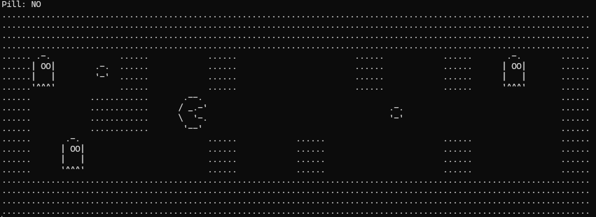

# Pac-Man Terminal Game

Este projeto implementa um jogo Pac-Man jogável no terminal usando a linguagem de programação C.

 

## Sumário

- [Introdução](#introdução)
- [Pré-requisitos](#pré-requisitos)
- [Como Jogar](#como-jogar)
- [Estrutura do Projeto](#estrutura-do-projeto)
- [Funções Principais](#funções-principais)

## Introdução

Este projeto é uma versão simplificada do clássico jogo Pac-Man, projetada para ser jogada diretamente no terminal. O jogo inclui características como movimento de fantasmas, coleta de pílulas, e detecção de colisões.

## Pré-requisitos

- Um compilador C (ex: `gcc`)
- Um terminal para executar o jogo

## Como Jogar

1. Clone o repositório ou baixe os arquivos do projeto.
2. Compile o código usando um compilador C. Exemplo:
   ```sh
   gcc pacman.c map.c ui.c -o pacman.exe
3. Execute o jogo no terminal:
    ```sh
    ./pacman


## Use as teclas de direção (W, A, S, D) para mover o Pac-Man pelo mapa:

W para cima

A para a esquerda

S para baixo

D para a direita

## Estrutura do Projeto
O projeto é composto pelos seguintes arquivos:

main.c: Contém a lógica principal do jogo e o loop do jogo.

map.c: Lida com as operações relacionadas ao mapa do jogo, como leitura, alocação e liberação de memória.

run.c: Contém as funções de movimento e comportamento dos fantasmas.

ui.c: Define os formatos gráficos para os elementos do jogo e a função para imprimir o mapa.

map.h, run.h, ui.h: Arquivos de cabeçalho que contêm as declarações de funções e definições de variáveis globais.

# Funções Principais

## main.c
over(): Verifica se o jogo acabou.

wheretheghostgoes(): Determina para onde os fantasmas devem ir.

ghosts(): Move todos os fantasmas no mapa.

move(): Move o herói (Pac-Man) na direção especificada.

explodepill(): Usa a pílula para limpar áreas ao redor do herói.

main(): Função principal que executa o loop do jogo.

## map.c
readmap(): Lê o mapa de um arquivo.

allocatemap(): Aloca memória para o mapa.

copymap(): Copia o mapa de origem para o destino.

freemap(): Libera a memória alocada para o mapa.

findmap(): Encontra um caractere específico no mapa e retorna sua posição.

canwalk(): Verifica se o personagem pode andar em uma determinada posição.

isvalid(), ischaracter(), iswall(): Funções auxiliares para verificar o estado de uma posição no mapa.

walk(): Move um personagem de uma posição para outra no mapa.

ui.c
printformat(): Imprime o formato especificado para uma peça do mapa.

printmap(): Imprime o mapa completo no terminal.

